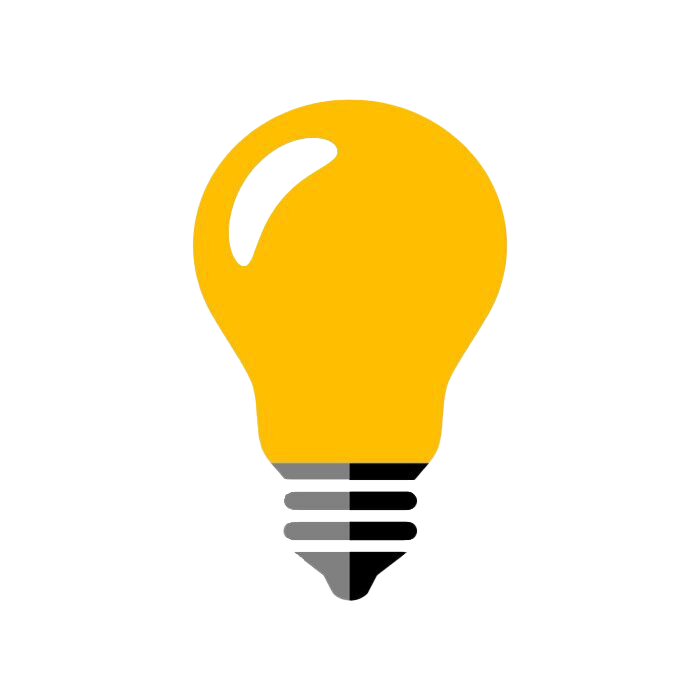

<h1 align="center">
Teste a Sua Lâmpada 💡
</h1>

  

  

  

# :clipboard: Sobre o projeto

Site simples no qual você pode acender ou desligar uma lâmpada!

Veja abaixo o resultado final do projeto.

 

   
  

## :computer: Tecnologias utilizadas

Este projeto foi desenvolvido com as seguintes tecnologias:

- [JavaScript](https://www.javascript.com/)
- [HTML](https://developer.mozilla.org/pt-BR/docs/Web/HTML)
- [CSS](https://developer.mozilla.org/pt-BR/docs/Web/CSS)

 

   
  

